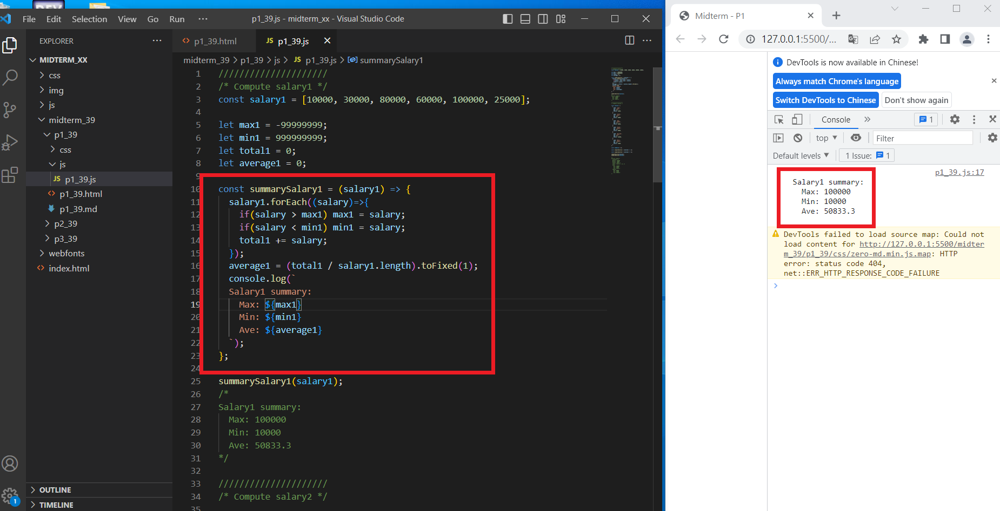
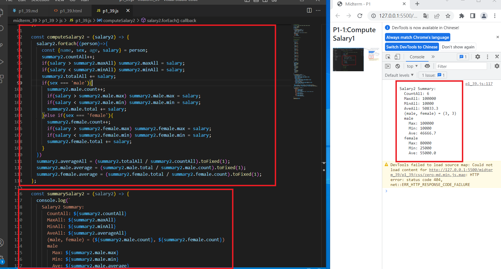
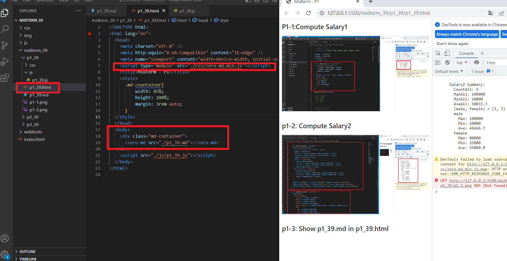
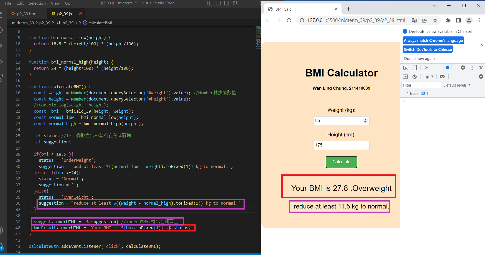
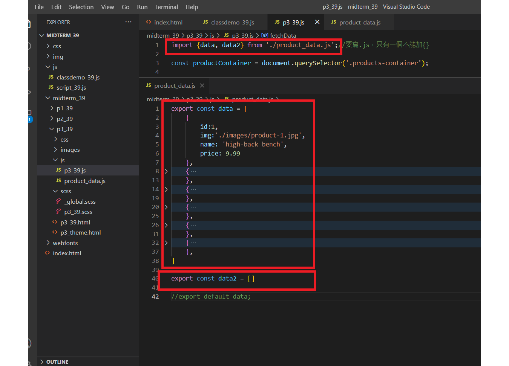
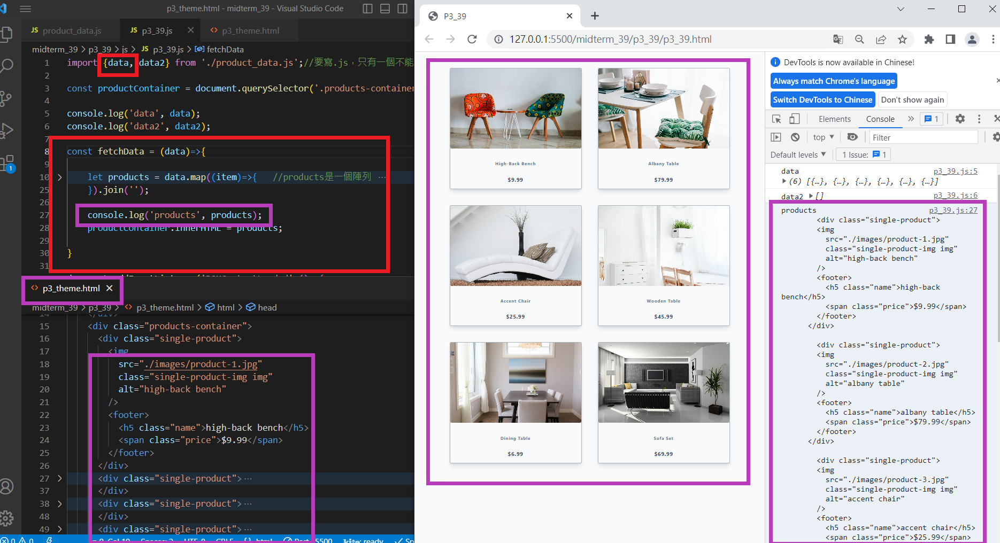
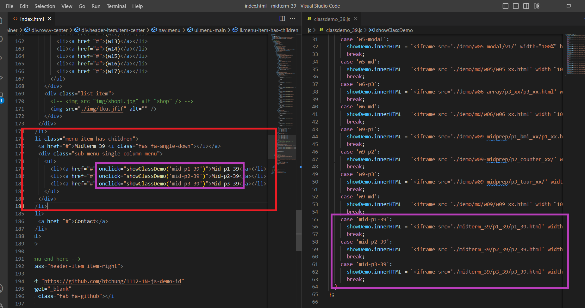
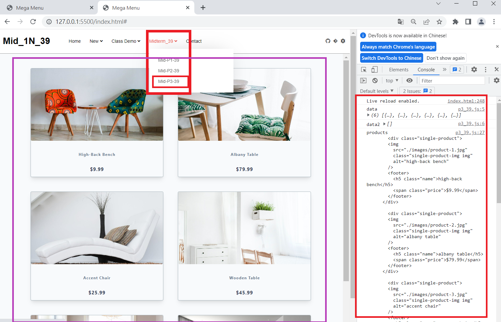

[Github URL](https://github.com/211410039/1112-1N-js-demo-id/tree/main/demo/md/w11_39)

### P1-1:Compute Salary1



### p1-2: Compute Salary2



### p1-3: Show p1_39.md in p1_39.html



### P2:BMI Calculation



### P3: Fetch Products from json array





### P4: Use menu to show P1, P2, P3





```
d949908 21141003901~    Thu Apr 27 22:01:12 2023 +0800  w11-midterm
```

$ git log --pretty=format:"%h%x09%an%x09%ad%x09%s" --after="2023-04-26"
d949908 21141003901~ Thu Apr 27 22:01:12 2023 +0800 w11-midterm
